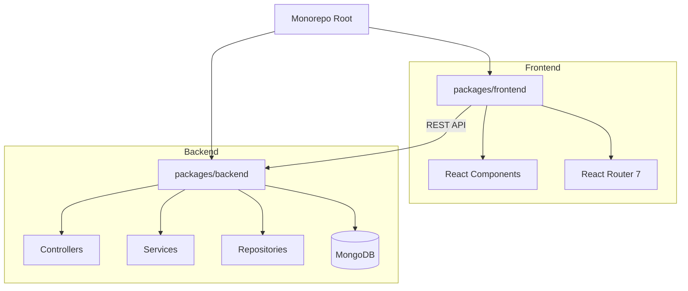
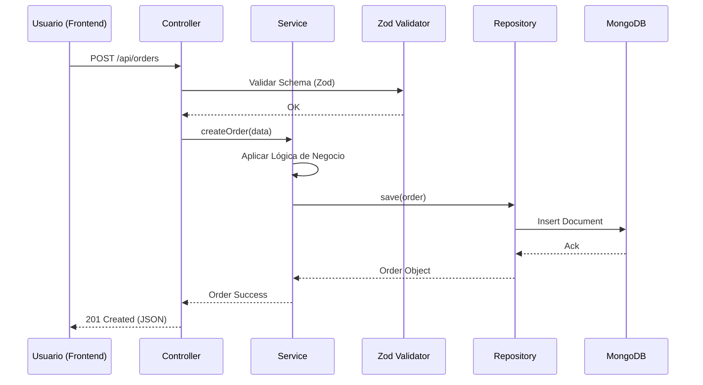

# 🛒 Tienda Sol - Marketplace Multi-Vendedor

[](https://deepwiki.com/BrunoRodriguezzz/Tp-desarrollo)

Este repositorio contiene el desarrollo de **Tienda Sol**, una plataforma de e-commerce full-stack con arquitectura multi-vendedor. El proyecto forma parte del Trabajo Práctico de la materia **Desarrollo de Software (DDS)** de la carrera **Ingeniería en Sistemas de Información** en la **UTN FRBA**.

Se trata de un **monorepo** que integra una aplicación frontend (React) y un backend (Express), gestionados mediante `npm workspaces`.

## 🌟 Propósito del Proyecto

Tienda Sol permite a los usuarios interactuar en un ecosistema de mercado dinámico donde pueden alternar entre dos roles principales:
- **Comprador:** Descubrimiento de catálogo, gestión de carrito y procesamiento de órdenes.
- **Vendedor:** Herramientas de gestión de productos y seguimiento de ventas.

## 🛠️ Stack Tecnológico

### Frontend
- **Framework:** React 19 (SPA)
- **Enrutamiento:** React Router 7
- **Estilos & UI:** Tailwind CSS, Ant Design y Material UI (MUI)
- **Gestión de Estado:** Hooks nativos y Context API

### Backend
- **Entorno:** Node.js con Express.js
- **Persistencia:** MongoDB usando Mongoose (ODM)
- **Validación:** Zod para esquemas de datos
- **Documentación:** Swagger / OpenAPI

### Infraestructura & DevOps
- **Gestión:** npm workspaces (Monorepo)
- **Contenerización:** Docker & Docker Compose
- **Orquestación Local:** Concurrently para ejecución simultánea de paquetes

---

## 🏗️ Arquitectura del Sistema

### Estructura de Paquetes


### Flujo de Interacción (Ejemplo: Compra de Producto)
El backend sigue un patrón de **arquitectura en capas** (Controller-Service-Repository) para garantizar la separación de responsabilidades.



---

## 📦 Organización del Monorepo

- `packages/backend/`: Contiene la lógica de negocio, acceso a datos y API REST. Implementa una cadena de inicialización por inyección de dependencias en `index.js`.
- `packages/frontend/`: Aplicación de página única (SPA) con diseño responsivo y componentes modernos.
- `.env.example`: Plantilla para configurar variables de entorno (Puertos, URLs de DB, etc.).

## 🚀 Inicio Rápido

### 1. Instalación de Dependencias
Desde la raíz del proyecto:
```bash
npm install
```

### 2. Configuración
Crea un archivo `.env` en `packages/backend/` basándote en el archivo de ejemplo:
```env
ALLOWED_ORIGINS=http://localhost:3000
SERVER_PORT=3001
MONGO_URI=mongodb://localhost:27017/tiendasol
```

### 3. Ejecución
Para levantar ambos entornos (frontend y backend) en modo desarrollo:
```bash
npm run start:dev
```

---

## 📝 Detalles de Implementación Destacados

1. **Inyección de Dependencias:** El backend utiliza una clase `Server` centralizada que orquesta el registro de rutas y servicios, facilitando la escalabilidad y el testing.
2. **Validación Robusta:** Se emplea **Zod** no solo para validar tipos en TypeScript, sino como primera línea de defensa en los controllers para asegurar la integridad de los datos entrantes.
3. **Multi-Vendor Logic:** El sistema está diseñado para que la transición entre comprador y vendedor sea fluida, compartiendo una base de autenticación unificada pero segregando las capacidades operativas.
4. **Testing:** El proyecto incluye una estrategia dual con tests unitarios/integración en el backend y tests End-to-End (E2E) en el frontend.

---
*Desarrollado en grupo para la cátedra de Desarrollo de Software - UTN FRBA.*
